# CarCrashNet

**A Large-Scale Dataset and Hierarchical Neural Solver for Data-Driven Structural Crash Simulation**

[](https://arxiv.org/abs/2605.07098)
[](#datasets)
[](#dataset-availability)

> Mohamed Elrefaie¹, Dule Shu², Matt Klenk², Faez Ahmed¹
> ¹ Massachusetts Institute of Technology  ² Toyota Research Institute

---

<p align="center">
  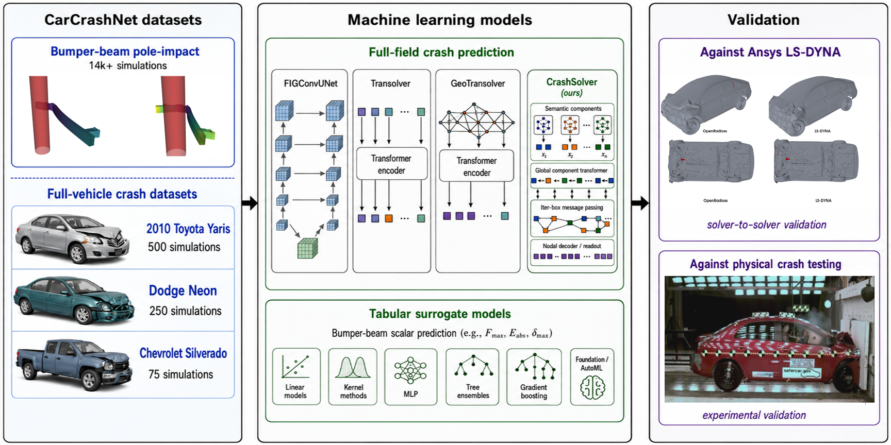
</p>

<p align="center">
  <em>Overview of the CarCrashNet framework: a large bumper-beam pole-impact dataset and three full-vehicle crash datasets (Toyota Yaris, Dodge Neon, Chevrolet Silverado), benchmarked across state-of-the-art neural solvers and validated against Ansys LS-DYNA and physical crash testing.</em>
</p>

---

## Overview

**CarCrashNet** is the first public, high-fidelity, open-source benchmark for data-driven structural crash simulation. It combines validated component-scale and full-vehicle finite-element crash data in a multi-modal, machine-learning-ready format, together with **CrashSolver**, a new hierarchical neural solver that achieves state-of-the-art performance across every released benchmark.

Structural crash simulation governs vehicle safety, but until now the field has lacked an open, validated, large-scale benchmark of the kind that has fueled progress in fluid dynamics, weather, and atomistic modeling. CarCrashNet closes that gap.

---

## Key Contributions

1. **Validated open-source crash workflow.** OpenRadioss benchmarked against both the industry-standard commercial solver **Ansys LS-DYNA** and **physical crash-test references**, agreeing within **7.2%** on peak wall force, **2.6%** on wall-force duration, and **0.5%** on peak internal energy.

2. **Two large-scale public datasets** at two levels of fidelity and complexity (see [Datasets](#datasets)).

3. **CrashSolver**, a hierarchical, part-aware neural solver for full-vehicle crash field prediction that **outperforms all state-of-the-art baselines on every released benchmark** (see [Benchmarks](#benchmarks)).

---

## Solver Validation — OpenRadioss vs. Ansys LS-DYNA

To establish dataset credibility we validate the open-source OpenRadioss workflow against the commercial industry-standard solver **Ansys LS-DYNA** on matched Toyota Yaris, Dodge Neon, and Chevrolet Silverado models, and against independent **physical crash-test references**.

<p align="center">
  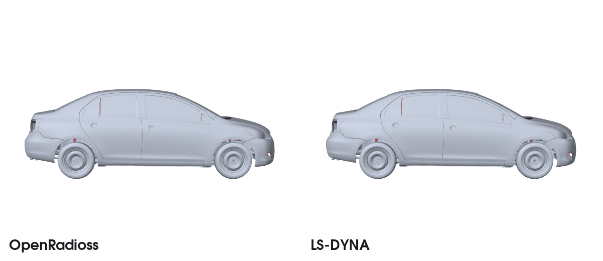
</p>

<p align="center">
  <em>Side-by-side, time-synchronised crash response of the same Toyota Yaris model simulated in OpenRadioss (open-source) and Ansys LS-DYNA (commercial).</em>
</p>

### Additional full-vehicle comparisons

<table align="center">
  <tr>
    <th align="center">Dodge Neon</th>
    <th align="center">Chevrolet Silverado</th>
  </tr>
  <tr>
    <td>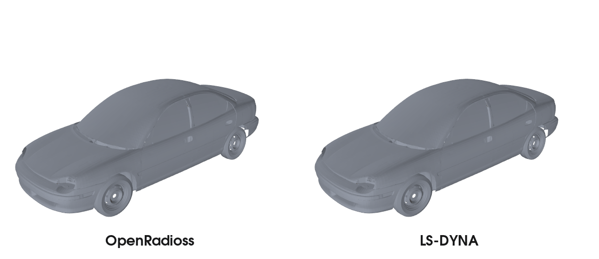</td>
    <td>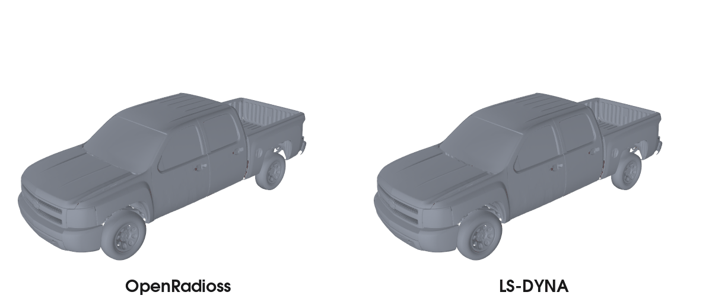</td>
  </tr>
</table>

<p align="center">
  <em>Front-isometric deformation histories for the matched NCAC v7 Neon deck at 56.16 km/h and CCSA V3e Silverado baseline at 35 mph. Frames are synchronized by normalized crash progress; rigid walls are hidden for structural clarity.</em>
</p>

Quantitative agreement for the Yaris LS-DYNA reference:

| Quantity | OpenRadioss vs. LS-DYNA |
|---|---:|
| CFC60 peak wall force | **7.2 %** |
| Wall-force duration | **2.6 %** |
| Peak internal energy | **0.5 %** |

Relative to the published Yaris physical crash test, OpenRadioss matches the impact speed within **0.2 %**, overpredicts peak wall force by **~14.6 %**, and underpredicts wall-force duration by **~19.6 %** — comparisons that support global-response agreement while transparently identifying contact- and pulse-shape quantities as solver-sensitive.

---

## Datasets

CarCrashNet releases **15,567** validated finite-element crash simulations — **6.65 TB** of mesh-resolved fields, time histories, and reduced crashworthiness metrics.

### 1. Bumper-Beam Pole-Impact Dataset — 14,742 simulations

A large component-scale corpus of frontal pole impacts on a DP1000 bumper beam + DP600 crash-box assembly. Seven engineering design variables are sampled with a scrambled Sobol design of experiments:

| Variable | Range |
|---|---|
| Impact velocity | 7.2 – 54.0 km/h |
| Crash-box thickness | 1.0 – 3.0 mm |
| Bumper-beam thickness | 1.0 – 3.0 mm |
| DP600 yield strength | 0.150 – 0.600 GPa |
| DP1000 yield strength | 0.250 – 1.000 GPa |
| Pole diameter | 100 – 500 mm |
| Lateral pole offset | 0 – 800 mm |

<p align="center">
  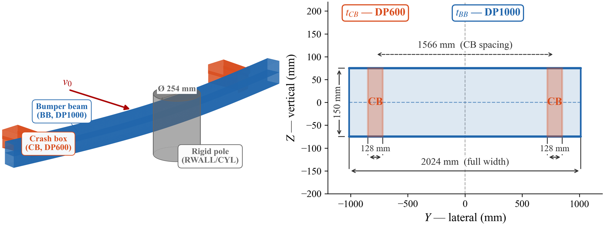
</p>

Each case ships with full-field VTKHDF trajectories, global/local time histories, and five scalar crashworthiness targets: peak pole contact force, peak deceleration, peak internal energy, peak plastic work, and kinetic-energy absorption fraction.

**Multi-physics field outputs** across the design space — displacement, von Mises stress, and equivalent plastic strain — shown from three viewing angles:

<table align="center">
  <tr>
    <th align="center">View</th>
    <th align="center">Displacement</th>
    <th align="center">von Mises stress</th>
    <th align="center">Plastic strain</th>
  </tr>
  <tr>
    <td align="center"><b>Isometric</b></td>
    <td></td>
    <td></td>
    <td></td>
  </tr>
  <tr>
    <td align="center"><b>Side</b></td>
    <td></td>
    <td></td>
    <td>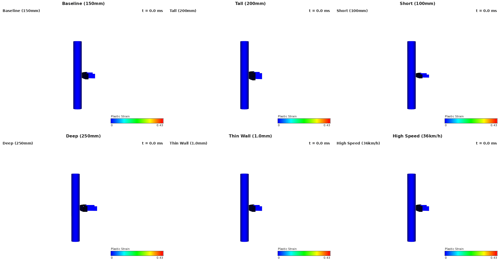</td>
  </tr>
  <tr>
    <td align="center"><b>Top</b></td>
    <td></td>
    <td></td>
    <td>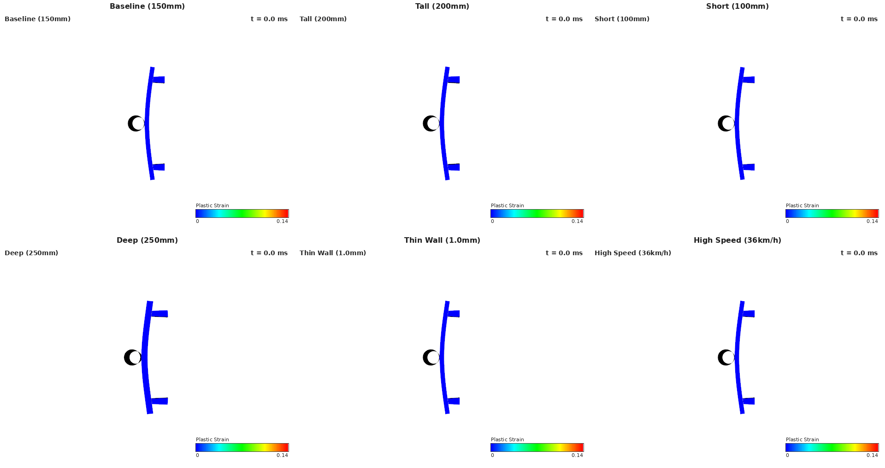</td>
  </tr>
</table>

### 2. Full-Vehicle Crash Dataset — 825 simulations

Vehicle-scale explicit FE crash simulations across **three industry-standard models** of increasing structural and geometric complexity:

| Vehicle | Class | Simulations | Edited structural groups |
|---|---|---:|---:|
| **Toyota Yaris** | Passenger sedan | 500 | 37 |
| **Dodge Neon** | Passenger sedan | 250 | 27 |
| **Chevrolet Silverado** | Pickup truck | 75 | 78 |

<p align="center">
  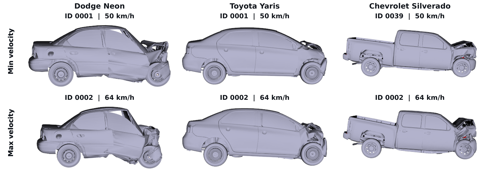
</p>

<p align="center">
  <em>Low- (top row) and high-velocity (bottom row) crash cases for the three vehicle-scale models.</em>
</p>

Each campaign varies impact velocity (50 – 64 km/h) and physically meaningful front-support and lower-rail / subframe shell thicknesses (±10%), producing realistic deformation modes across the frontal crash load path.

<p align="center">
  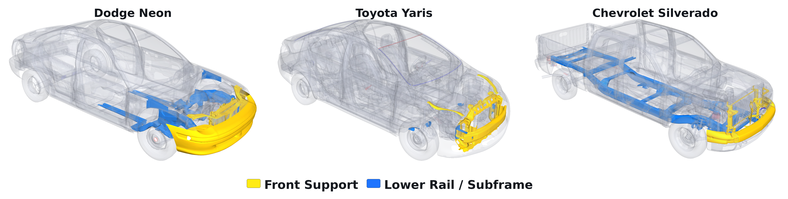
</p>

Every case is released with:
- **Field trajectories** (VTKHDF): reference + deformed mesh, displacement, velocity, von Mises stress, plastic strain, internal energy, erosion flags, part IDs.
- **Global & local time histories**: rigid-wall force, kinetic / internal / contact / hourglass energies, local accelerations.
- **Reduced scalar targets**: peak wall force, peak internal energy, KE absorption, peak deceleration, impulse duration.

---

## CrashSolver

CrashSolver is a hierarchical machine-learning solver designed for full-vehicle crash field prediction. It exploits the **finite-element part hierarchy** as an inductive bias.

<p align="center">
  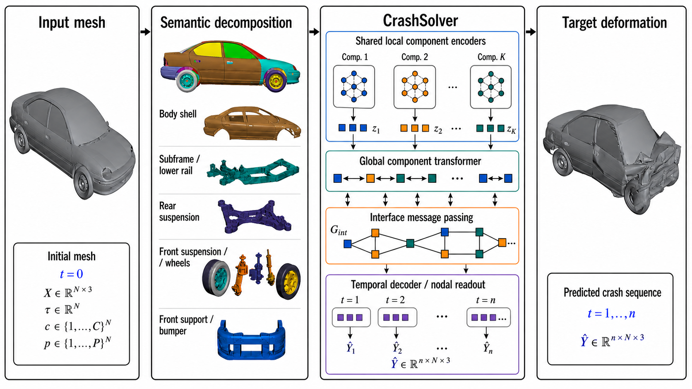
</p>

1. **Semantic decomposition** of the vehicle into structural groups (bumper, rails, radiator support, shock housings, subframe, engine bay, cabin floor, rocker, pillars, exterior panels).
2. **Shared local component encoders** that learn deformation on smaller structural token sets — not over a single monolithic mesh.
3. **Global component transformer** that mixes component summaries.
4. **Mesh-derived interface message passing** that exchanges latent features across component boundaries.
5. **Temporal decoder / nodal readout** that emits the full crash displacement trajectory.

This design preserves the high-resolution nodal deformation field while giving the network an explicit representation of the crash load paths.

---

## Benchmarks

### Full-vehicle crash field prediction — CrashSolver achieves the lowest error on every dataset

Mean error on the **unseen hidden test set** of each CarCrashNet vehicle benchmark. Lower is better; best in **bold**.

| Dataset | Model | RMSE (mm) ↓ | MAE (mm) ↓ | Relative L₂ (pos) ↓ | Relative L₂ (disp) ↓ |
|---|---|---:|---:|---:|---:|
| **Dodge Neon** | **CrashSolver** | **32.763** | **18.036** | **0.02499** | **0.08837** |
| | Transolver | 33.947 | 18.678 | 0.02589 | 0.09148 |
| | FIGConvUNet | 34.044 | 18.850 | 0.02597 | 0.09196 |
| | GeoTransolver | 34.403 | 18.973 | 0.02628 | 0.09349 |
| **Toyota Yaris** | **CrashSolver** | **21.769** | 13.507 | **0.01537** | **0.09043** |
| | GeoTransolver | 21.773 | **13.359** | **0.01537** | 0.09059 |
| | FIGConvUNet | 21.910 | 13.576 | 0.01547 | 0.09105 |
| | Transolver | 22.583 | 14.049 | 0.01594 | 0.09391 |
| **Chevrolet Silverado** | **CrashSolver** | **61.536** | **37.753** | **0.03143** | **0.17069** |
| | GeoTransolver | 79.230 | 45.366 | 0.04049 | 0.21844 |
| | Transolver | 83.971 | 47.510 | 0.04291 | 0.23184 |
| | FIGConvUNet | 102.747 | 62.405 | 0.05248 | 0.28432 |

CrashSolver wins on **every metric, on every vehicle**. The advantage grows with structural complexity: on the Silverado pickup truck, CrashSolver reduces RMSE by **~22%** relative to the strongest competing baseline (GeoTransolver).

<p align="center">
  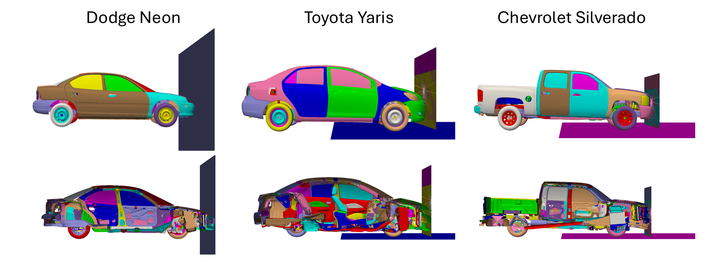
</p>

### Bumper-beam tabular surrogate benchmark

We additionally release a compact tabular benchmark on the 14,742-simulation bumper-beam corpus that compares 12 model families — linear models, kernel methods, MLP, tree ensembles, gradient boosting (XGBoost, LightGBM, CatBoost), a tabular foundation model (TabPFN v2), and AutoGluon AutoML — across five crashworthiness targets. Full per-target results are reported in the paper.

---

## Dataset Availability

> **The CarCrashNet datasets will be publicly released upon acceptance / completion of peer review.**

This repository currently hosts the high-level description of the work. We will update this page with download links and loading utilities for the bumper-beam and full-vehicle datasets once the peer-review process is complete.

---

## Citation

If you use CarCrashNet, CrashSolver, or any of the released datasets, please cite:

```bibtex
@article{elrefaie2026carcrashnet,
  title   = {CarCrashNet: A Large-Scale Dataset and Hierarchical Neural Solver
             for Data-Driven Structural Crash Simulation},
  author  = {Elrefaie, Mohamed and Shu, Dule and Klenk, Matt and Ahmed, Faez},
  journal = {arXiv preprint arXiv:2605.07098},
  year    = {2026}
}
```

---

## Contact

For questions or collaboration: **mohamed.elrefaie@mit.edu**
